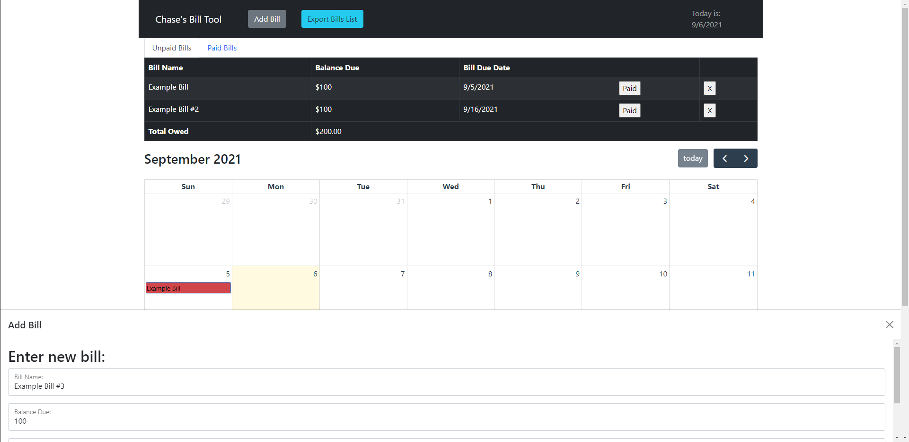

<!-- PROJECT LOGO -->
<br />
<p align="center">
  <a href="https://github.com/chase-skibeness/bills-calc">
    
  </a>

  <h3 align="center">Bill Scheduler Tool</h3>

  <p align="center">
    A simple tool for keeping track of bill amounts and their due dates.
    <br />
    <br />
    <a href="https://github.com/chase-skibeness/bills-calc">View Demo</a>
    ·
    <a href="https://github.com/chase-skibeness/bills-calc/issues">Report Bug</a>
    ·
    <a href="https://github.com/chase-skibeness/bills-calc/issues">Request Feature</a>
  </p>
</p>


<!-- TABLE OF CONTENTS -->
<details open="open">
  <summary><h2 style="display: inline-block">Table of Contents</h2></summary>
  <ol>
    <li>
      <a href="#about-the-project">About The Project</a>
      <ul>
        <li><a href="#built-with">Built With</a></li>
      </ul>
    </li>
    <li>
      <a href="#getting-started">Getting Started</a>
      <ul>
        <li><a href="#prerequisites">Prerequisites</a></li>
        <li><a href="#installation">Installation</a></li>
      </ul>
    </li>
    <li><a href="#usage">Usage</a></li>
    <li><a href="#roadmap">Roadmap</a></li>
    <li><a href="#contributing">Contributing</a></li>
    <li><a href="#contact">Contact</a></li>
  </ol>
</details>


<!-- ABOUT THE PROJECT -->
## About The Project

<p>I needed something simple to get started with React and noticed I was constantly trying to remember the dates of bills that needed to be paid. So I made this:</p>



### Built With

* [React](https://reactjs.org)
* [Full Calendar](https://fullcalendar.io/)
* [React Bootstrap](https://react-bootstrap.github.io/)

<br />


<!-- GETTING STARTED -->
## Getting Started

To get a local copy up and running follow these simple steps.

### Prerequisites

This is an example of how to list things you need to use the software and how to install them.
* npm
  ```sh
  npm install npm@latest -g
  ```

### Installation

1. Clone the repo
   ```sh
   git clone https://github.com/chase-skibeness/bills-calc.git
   ```
2. Install NPM packages
   ```sh
   npm install
   ```


<!-- USAGE EXAMPLES -->
## Usage

Just a simple tool to keep track of bills. To import many bills at once edit this file: 
```sh
/src/BillSource.json
```


<!-- ROADMAP -->
## Roadmap

1. [x] Calendar Schedule display
2. [ ] Importer tool to quickly create bill lists
3. [x] Bootstrap redesign
4. [x] Export tool to save bills list out of local storage
5. [ ] Local storage caching


<!-- CONTRIBUTING -->
## Contributing

Contributions are what make the open source community such an amazing place to be learn, inspire, and create. Any contributions you make are **greatly appreciated**.

1. Fork the Project
2. Create your Feature Branch (`git checkout -b feature/AmazingFeature`)
3. Commit your Changes (`git commit -m 'Add some AmazingFeature'`)
4. Push to the Branch (`git push origin feature/AmazingFeature`)
5. Open a Pull Request


<!-- CONTACT -->
## Contact

Chase Skibeness - chaseskibbs@gmail.com

Project Link: [https://github.com/chase-skibeness/bills-calc](https://github.com/chase-skibeness/bills-calc)


<!-- MARKDOWN LINKS & IMAGES -->
<!-- https://www.markdownguide.org/basic-syntax/#reference-style-links -->
[contributors-shield]: https://img.shields.io/github/contributors/chase-skibeness/repo.svg?style=for-the-badge
[contributors-url]: https://github.com/chase-skibeness/bills-calc/graphs/contributors
[forks-shield]: https://img.shields.io/github/forks/chase-skibeness/repo.svg?style=for-the-badge
[forks-url]: https://github.com/chase-skibeness/bills-calc/network/members
[stars-shield]: https://img.shields.io/github/stars/chase-skibeness/repo.svg?style=for-the-badge
[stars-url]: https://github.com/chase-skibeness/bills-calc/stargazers
[issues-shield]: https://img.shields.io/github/issues/chase-skibeness/repo.svg?style=for-the-badge
[issues-url]: https://github.com/chase-skibeness/bills-calc/issues
[license-shield]: https://img.shields.io/github/license/chase-skibeness/repo.svg?style=for-the-badge
[linkedin-shield]: https://img.shields.io/badge/-LinkedIn-black.svg?style=for-the-badge&logo=linkedin&colorB=555
[linkedin-url]: https://linkedin.com/in/chase-skibeness
